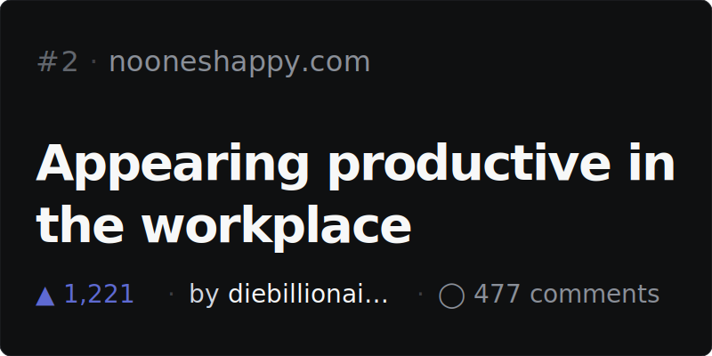
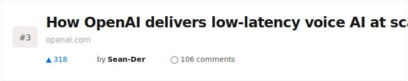
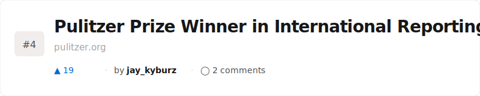
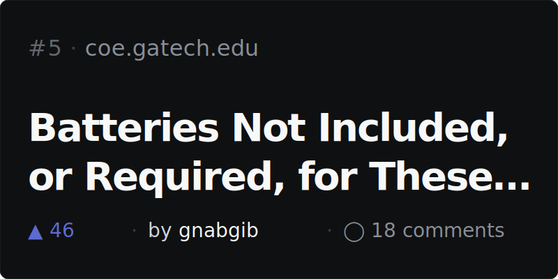

# Riccino22

<!-- NEWSLETTER_START -->

### 📰 Top 5 on Hacker News · May 7, 2026
> Automatically updated every day with the most upvoted stories. Click any card to read the article.

<table width="100%">
<tr>
<td width="50%"></td>
<td width="50%"></td>
</tr>
<tr>
<td width="50%"></td>
<td width="50%"></td>
</tr>
<tr>
<td width="50%"></td>
<td width="50%"></td>
</tr>
</table>

<!-- NEWSLETTER_END -->
