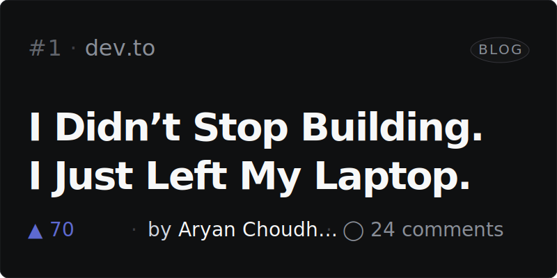
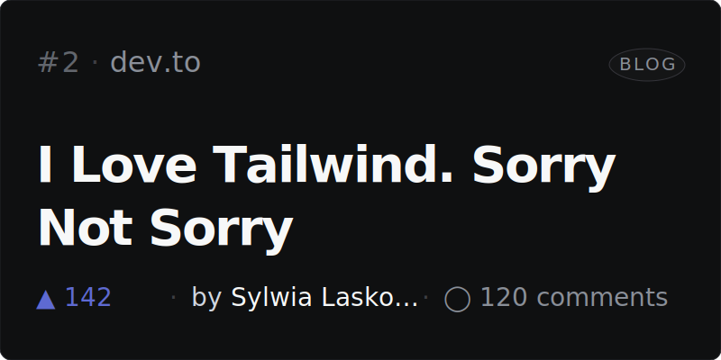
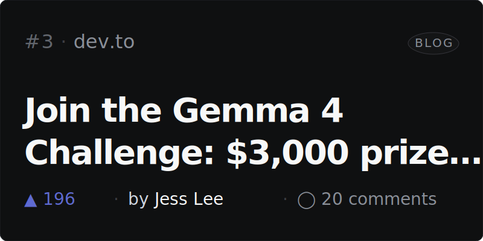
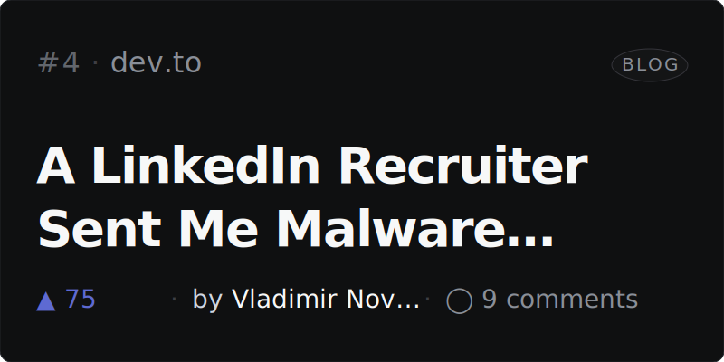
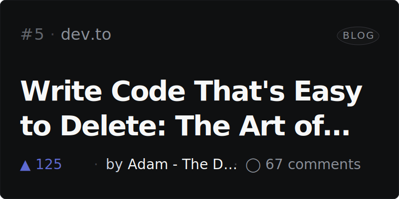

# Riccino22

<!-- NEWSLETTER_START -->

### 📰 Top 5 on Hacker News · May 8, 2026
> Automatically updated every day with the most upvoted stories. Click any card to read the article.

<table width="100%">
<tr>
<td width="50%"></td>
<td width="50%"></td>
</tr>
<tr>
<td width="50%"></td>
<td width="50%"></td>
</tr>
<tr>
<td width="50%"></td>
<td width="50%"></td>
</tr>
</table>

---

### 👩‍💻 Top 5 on Dev.to · May 8, 2026
> Top articles from the dev.to community this week. Click any card to read the post.

<table width="100%">
<tr>
<td width="50%"></td>
<td width="50%"></td>
</tr>
<tr>
<td width="50%"></td>
<td width="50%"></td>
</tr>
<tr>
<td width="50%"></td>
<td width="50%"></td>
</tr>
</table>

<!-- NEWSLETTER_END -->
