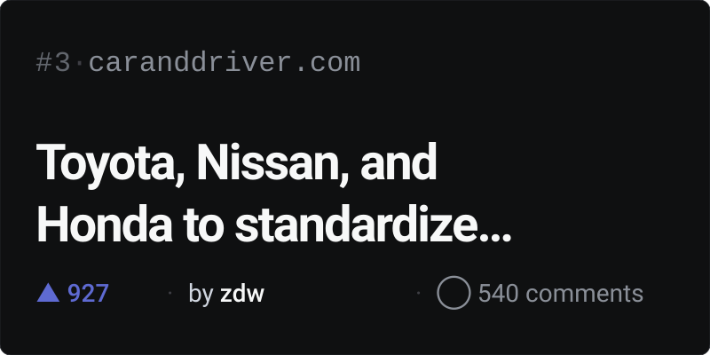

# Riccino22

<!-- NEWSLETTER_START -->

### 📰 Top 5 on Hacker News · November 27, 2026
> Automatically updated every day with the most upvoted stories. Click any card to read the article.

<table width="100%">
<tr>
<td width="50%"></td>
<td width="50%"></td>
</tr>
<tr>
<td width="50%"></td>
<td width="50%"></td>
</tr>
<tr>
<td width="50%"></td>
<td width="50%"></td>
</tr>
</table>

---

### 🦞 Top 5 on Lobste.rs · November 27, 2026
> Curated tech stories voted on by the Lobste.rs community. Click any card to read the article.

<table width="100%">
<tr>
<td width="50%"></td>
<td width="50%"></td>
</tr>
<tr>
<td width="50%"></td>
<td width="50%"></td>
</tr>
<tr>
<td width="50%"></td>
<td width="50%"></td>
</tr>
</table>

<!-- NEWSLETTER_END -->
